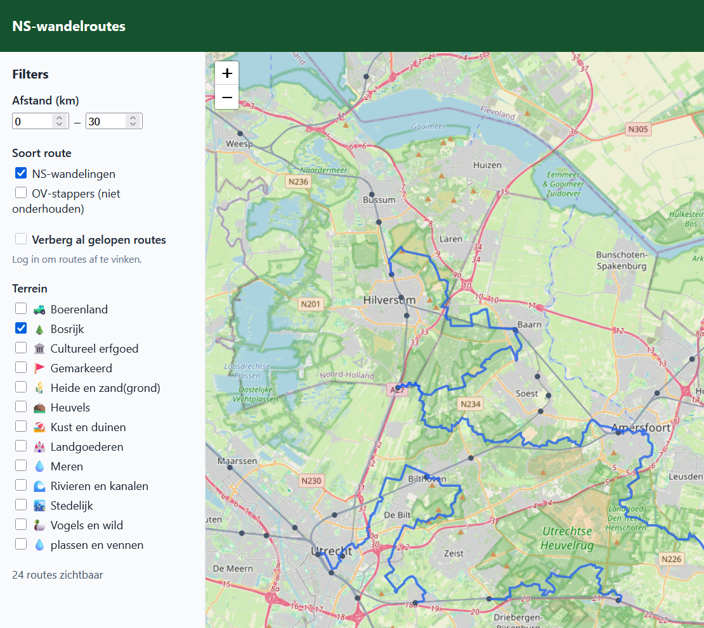
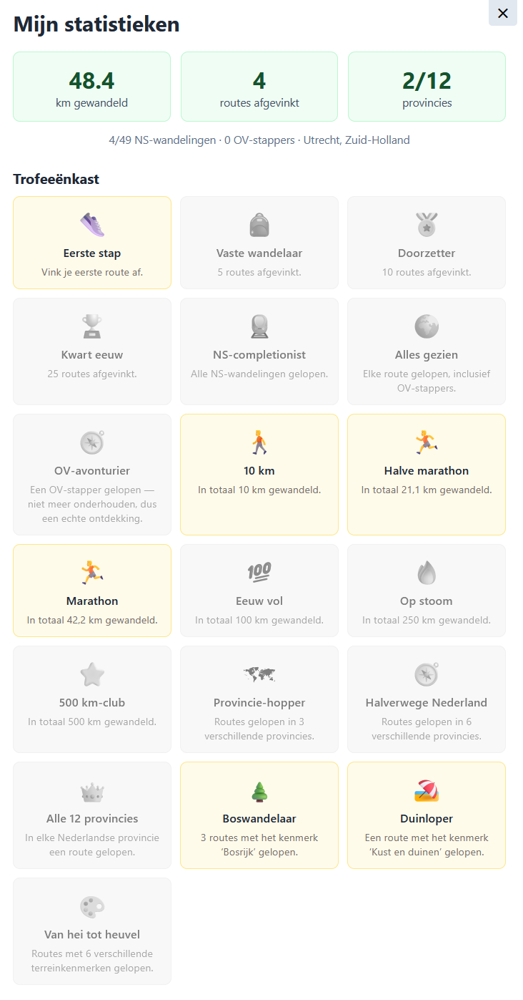

# NS-wandelroutes kaart

An interactive map of every [NS-wandeling and OV-stapper](https://www.wandelnet.nl/ns-wandelingen)
(Dutch "station-to-station" hiking route) in the Netherlands, plotted on top
of the national main rail network, with filtering by distance and terrain,
optional per-account tracking of which routes you've already walked, and a
small stats dashboard with achievements for the completionists.

> **Unofficial project.** Not affiliated with Wandelnet or NS. All route
> data belongs to [wandelnet.nl](https://www.wandelnet.nl/) — this project
> just visualizes it and always links back to the original route page.

## Why

Wandelnet publishes ~90 great station-to-station hiking routes. Their own
[route search](https://www.wandelnet.nl/wandelroute-zoeken) lets you filter
by province, route type, and a min/max distance — but there's no way to
filter by landscape (forest, heath, dunes, ...), and its overview map only
plots each route's *starting point* as a dot, not the route itself; you
only see the actual path once you open a route's individual page. There's
also no way to track which ones you've already walked. This project
scrapes the public route data (metadata, terrain tags, and GPS tracks) into
a single dataset and renders every route as an actual line on one map,
filterable by both distance and terrain.

## Screenshots



The stats dashboard (🏆 button, once logged in): total distance walked,
routes checked off, province coverage, and the achievements trophy case —
unlocked ones in yellow, locked ones grayed out with the goal still shown.



## Features

- Interactive [Leaflet](https://leafletjs.com/) map of the Dutch main rail
  network, all stations, and every NS-wandeling and OV-stapper route.
- Hover a route for its name, length, and terrain icons; click it for a
  popup with full details and a link back to its page on wandelnet.nl.
- Filter by distance range, route type (NS-wandeling vs. the unmaintained
  OV-stapper routes), and terrain (forest, heathland, dunes, water, hills,
  urban, ...).
- Optional accounts (name + password, self-service signup) so you — and
  anyone you share the site with — can check off routes you've walked,
  each with their own independent list.
- A stats dashboard (🏆 button once logged in) showing total distance
  walked, routes checked off, province coverage, and ~19 achievements
  (distance milestones, province coverage, terrain variety, completionist
  badges, ...) that unlock automatically as you check off routes.
- Tuned for touch: routes have a generous invisible tap area so they're
  easy to hit on a phone, not just with a mouse.

## How it works

- `scraper/scrape_routes.py` scrapes wandelnet.nl's route overview pages
  and each route's detail page for its name, stations, length(s), and
  terrain tags, then downloads its GPS track and converts it to GeoJSON.
- `scraper/fetch_rail_network.py` pulls the Dutch main rail network from
  the [OpenStreetMap Overpass API](https://overpass-api.de/) and station
  locations from [rijdendetreinen.nl](https://www.rijdendetreinen.nl/en/open-data/stations)'s
  open dataset, also as GeoJSON.
- `scraper/assign_provinces.py` tags each route with its province, needed
  for the province-based achievements. Wandelnet doesn't expose this per
  route, so it's derived by checking which official province boundary
  (from [PDOK/CBS via cartomap.github.io](https://github.com/cartomap/nl))
  contains the route's starting point.
- All three are meant to be run occasionally, not on every page load — the
  underlying data barely changes. Output lands in `data/` as static files.
- `backend/` is a small Flask + SQLite app that serves the map and the
  generated data, plus a minimal accounts API for tracking checked-off
  routes per user. `backend/achievements.py` derives all stats and
  achievements on the fly from someone's checked routes — nothing extra is
  stored, so adding new achievements there applies retroactively to
  everyone.
- `static/` is the map itself: vanilla JS + Leaflet, no build step.

## Requirements

- Python 3.10+
- A machine to run the Flask app on (a Raspberry Pi, a VPS, an LXC
  container, or just your own laptop for local use)

## Quick start

See **[SETUP.md](SETUP.md)** for the full walkthrough, including production
deployment behind a reverse proxy. The short version, for local use:

```bash
python3 -m venv .venv
./.venv/bin/pip install -r scraper/requirements.txt -r backend/requirements.txt

./.venv/bin/python scraper/scrape_routes.py
./.venv/bin/python scraper/fetch_rail_network.py
./.venv/bin/python scraper/assign_provinces.py

FLASK_DEBUG=1 ./.venv/bin/python backend/app.py
```

Then open http://localhost:5000.

## Data sources & attribution

- Route metadata, terrain tags, and GPS tracks: [wandelnet.nl](https://www.wandelnet.nl/)
  (via their [routemaker.nl](https://routemaker.nl/) GPX downloads).
- Rail network: © [OpenStreetMap](https://www.openstreetmap.org/copyright)
  contributors, [ODbL](https://opendatacommons.org/licenses/odbl/).
- Station locations: [rijdendetreinen.nl](https://www.rijdendetreinen.nl/en/open-data/stations)
  open dataset (CC0).
- Province boundaries: PDOK/CBS, simplified for cartography by
  [cartomap.github.io](https://github.com/cartomap/nl).
- Base map tiles: OpenStreetMap.

## Limitations

- 1 route (Naardermeer) failed to scrape at the time this was built — its
  detail page returned a 404. Re-run the scraper to check if it's back.
- A handful of terrain tags get split into two filter tags (e.g. "Meren,
  plassen en vennen" becomes "Meren" and "plassen en vennen") because
  wandelnet.nl lists them as plain comma-separated text with no clear
  separator. Cosmetic only — doesn't affect filtering.
- No CSRF protection on the "mark as walked" endpoint — the worst case is
  someone's own checkbox getting toggled via a malicious page they have
  open, not anything more serious.
- Self-service signup has no invite gate — anyone with the link can create
  an account. Fine for sharing with friends/family; add an invite-code
  check in `backend/app.py` if you need stricter access control.
- "Total distance walked" uses the *longest* length variant of each route
  (many routes have multiple, e.g. "10.5 or 17.5 km") since there's no way
  to know which one you actually walked. Applies to everyone on the same
  instance — if most of your users tend to walk the shorter variant, this
  will overstate their distance; treat it as an indication, not an exact
  figure.
- One route (Krickenbecker Seen) starts just across the German border, so
  it has no assigned province and never counts toward province-based
  achievements.

## License

Code is [MIT](LICENSE). Route, rail, and station data belong to their
respective sources above and are *not* covered by this license — check
their terms before reusing the generated `data/*.geojson` files elsewhere.
